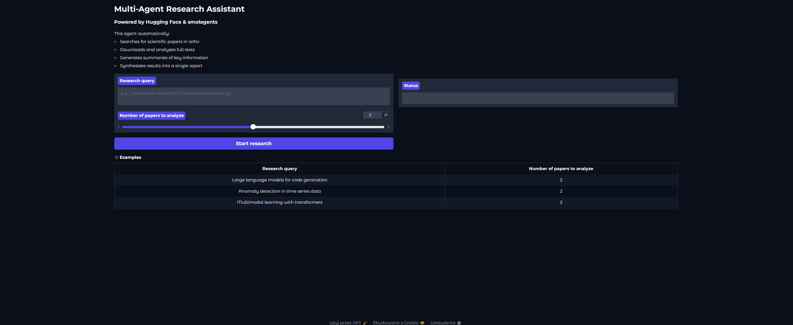
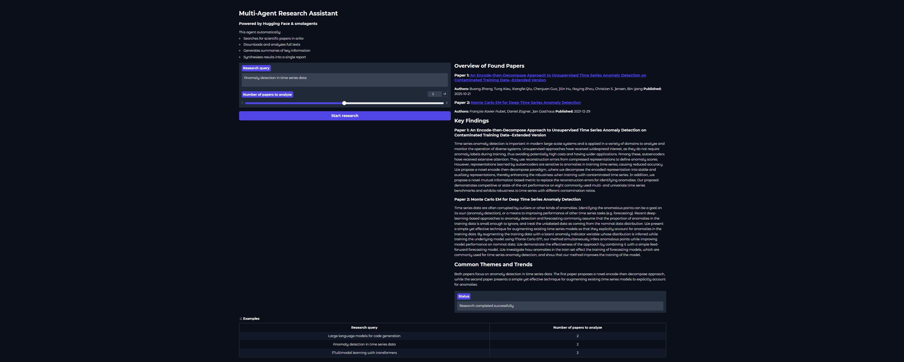

# Multi-Agent Research Assistant

An intelligent research automation tool that leverages AI agents to search, download, analyze, and summarize scientific papers from arXiv. Built with Hugging Face's smolagents framework and powered by state-of-the-art language models.



## Features
- Automated research workflow: Orchestrates multiple AI agents to conduct comprehensive literature reviews

- arXiv integration: Searches and downloads scientific papers directly from arXiv database

- Intelligent summarization: Uses BART-large-CNN model to generate concise summaries of research papers

- PDF processing: Automatically extracts and processes text from research papers

- Interactive UI: Clean Gradio interface for easy interaction and real-time results

- Flexible configuration: Customizable number of papers and research queries

- Structured reports: Generates formatted markdown reports with paper overviews, key findings, and trends





## Tech stack

### Core framework
- smolagents: Hugging Face's library for building LLM-powered agents

- Gradio: Interactive web interface for user interaction

- LiteLLM: Model-agnostic LLM integration

### AI models
- Llama 3.3 70B Versatile (via Groq): Primary reasoning engine for the orchestrator agent

- BART-large-CNN: Text summarization model


### Libraries & Tools
- arxiv: Python wrapper for arXiv API

- PyPDF2: PDF text extraction

- transformers: Hugging Face transformers for NLP models

- python-dotenv: Environment configuration management

## Prerequisites
- Python 3.8+

- Groq API key (for Llama 3.3 access)

- Hugging Face token (for extended API access)

## Installation

1. Clone the repository
```bash
git clone https://github.com/Kaskra13/ai_research_assistant
cd ai-research-assistant
```

2. Create a virtual environment
```bash
python -m venv venv
source venv/bin/activate  
# On Windows: venv\Scripts\activate
```

3. Install dependencies
```bash
pip install -r requirements.txt
```

4. Set up environment variables
Create a `.env` file in the root directory:
```text
GROQ_API_KEY=your_groq_api_key_here
HF_TOKEN=your_huggingface_token_here 
```

## Usage

1. Start the application
```bash
python app.py
```

2. Access the interface

Open your browser and navigate to http://127.0.0.1:7860 or the Gradio interface will launch automatically.


3. Conduct research

- Enter your research query (e.g., "Anomaly detection in time series data")

- Select the number of papers to analyze (1-3)

- Click "Start research" and wait for the AI agents to complete the workflow

4. Review results
- The system will display a formatted markdown report containing:

  - Overview of found papers with clickable links

  - Key findings from each paper

  - Common themes and trends across the research
 
## Project structure
```text
multi-agent-research-assistant/
├── agents/
│   └── orchestrator.py          # Main research orchestration agent
├── tools/
│   ├── arxiv_tools.py           # arXiv search and download tools
│   ├── pdf_tools.py             # PDF text extraction tool
│   └── summarization_tools.py   # Text summarization tool
├── app.py                        # Gradio web interface
├── config.py                     # Configuration and environment variables
├── .env                          # Environment variables (not in repo)
├── requirements.txt              # Python dependencies
└── README.md                     # Project documentation
```

## Configuration
Modify `config.py` to customize:
```python
# Model configuration
SUMMARIZATION_MODEL = "facebook/bart-large-cnn"
AGENT_LLM = "groq/llama-3.3-70b-versatile"

# Research parameters
MAX_PAPERS = 5              # Maximum papers to analyze
MAX_SUMMARY_LENGTH = 250    # Maximum summary length
MIN_SUMMARY_LENGTH = 50     # Minimum summary length
CHUNK_SIZE = 1024           # Text chunk size for processing
MAX_AGENT_STEPS = 10        # Maximum agent reasoning steps
```

## How it works

The system uses a multi-agent architecture powered by smolagents:

1. ResearchOrchestrator Agent: The main coordinator that manages the research workflow

2. ArxivSearchTool: Searches the arXiv database for relevant papers

3. DownloadPaperTool: Downloads full PDF texts of selected papers

4. PDFExtractorTool: Extracts text content from PDF files

5. SummarizationTool: Generates concise summaries using BART


## Workflow

1. User submits a research query

2. Agent searches arXiv for most relevant papers

3. For each paper, the agent:

- Extracts metadata (title, authors, publication date)

- Downloads the full PDF

- Extracts text from the PDF

- Generates an AI-powered summary

4. Agent synthesizes all findings into a structured report

5. Results are displayed in formatted markdown
